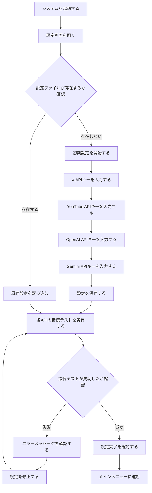
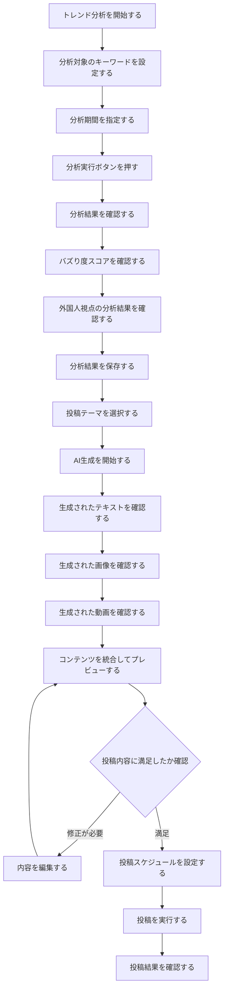
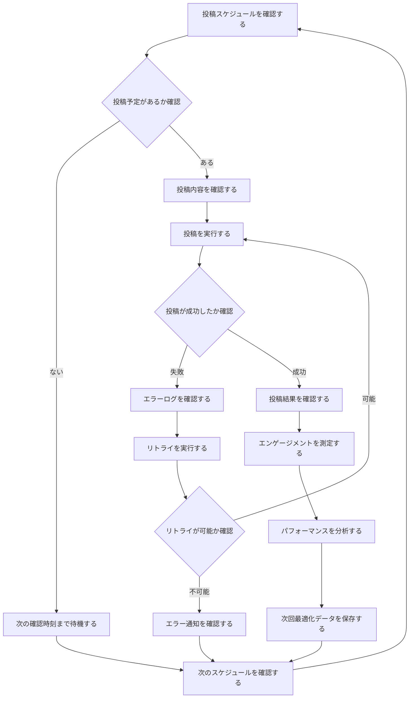
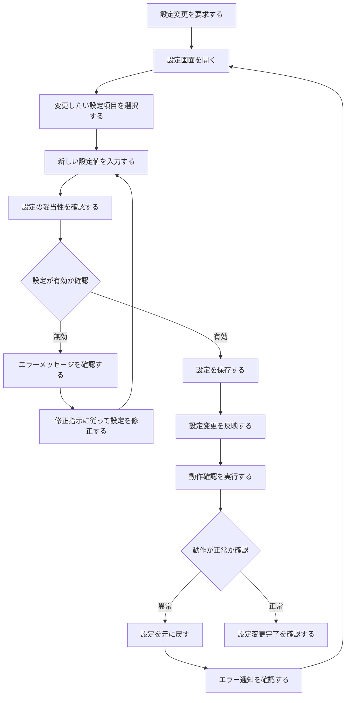
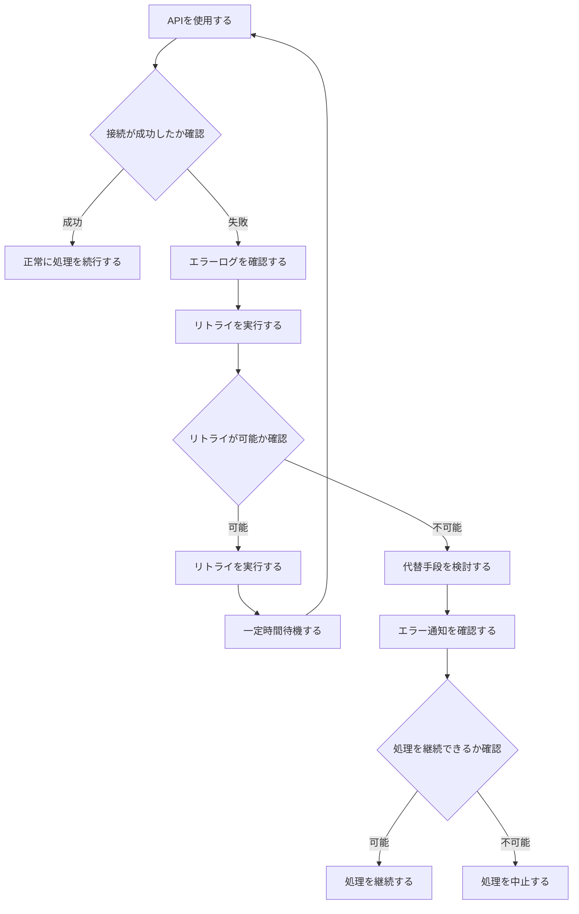
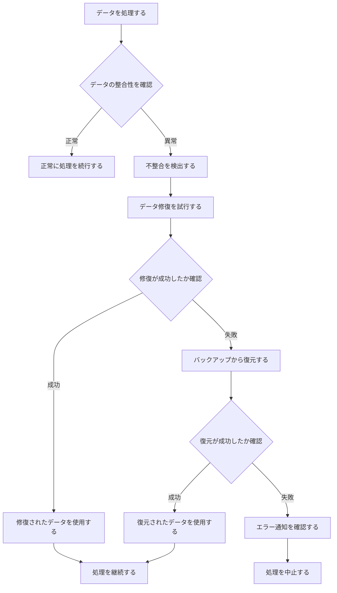
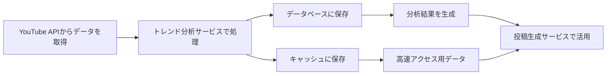
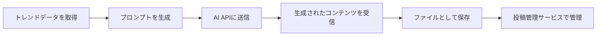

# Xbot 業務フロー定義書

## ドキュメント情報
- **作成日**: 2024年12月19日
- **バージョン**: 1.0
- **対象システム**: Xbot（SNS投稿ボット）システム
- **作成者**: ビジネスアナリスト

## 1. 概要

### 1.1 目的
本ドキュメントは、Xbotシステムのビジネス要件を整理し、主要な業務フローを定義します。システムの利用者がどのような手順でシステムを活用し、どのような価値を得るかを明確化します。

### 1.2 ビジネス目標
- **時間の節約**: 投稿の企画から実行までを自動化
- **エンゲージメント向上**: データに基づく最適な投稿タイミング
- **グローバル視点**: 外国人視点を取り入れた独自性のあるコンテンツ
- **トレンド対応**: リアルタイムのトレンド分析と活用
- **クリエイティブ支援**: AIによる創造的なコンテンツ生成

### 1.3 利害関係者
- **主要ユーザー**: 個人開発者（SNS投稿者）
- **システム管理者**: 開発者本人
- **外部サービス**: YouTube、X（Twitter）、OpenAI、Google Gemini

## 2. 主要業務フロー

### 2.1 システム初期設定フロー

**業務説明**:
1. **システム起動**: ユーザーがフロントエンド・バックエンドを起動
2. **設定確認**: 既存の設定ファイルの存在を確認
3. **初期設定**: 初回利用時に各APIキーを入力・設定
4. **接続テスト**: 各APIの接続をテストして動作確認
5. **設定完了**: 利用可能状態への移行確認

### 2.2 トレンド分析・投稿生成フロー

**業務説明**:
1. **トレンド分析設定**: 分析対象と期間を指定
2. **分析実行**: 分析ボタンを押して実行
3. **結果確認**: バズり度スコアと外国人視点の分析を確認
4. **テーマ選択**: 投稿テーマを選択
5. **AI生成**: テキスト・画像・動画の生成を実行
6. **内容確認**: 生成されたコンテンツを確認・編集
7. **スケジュール設定**: 投稿タイミングを設定
8. **投稿実行**: 実際に投稿を実行

### 2.3 定期投稿管理フロー

**業務説明**:
1. **スケジュール確認**: 投稿予定の確認
2. **内容確認**: 投稿内容の最終確認
3. **投稿実行**: 設定されたタイミングでの投稿
4. **結果確認**: 投稿結果とエンゲージメントの確認
5. **パフォーマンス分析**: 投稿効果の測定と分析
6. **最適化**: 次回投稿の改善データとして活用

### 2.4 設定管理フロー

**業務説明**:
1. **設定変更要求**: 設定変更の必要性を認識
2. **設定画面操作**: 設定画面を開いて項目選択
3. **設定値入力**: 新しい設定値を入力
4. **妥当性確認**: 入力値の妥当性を確認
5. **設定保存**: 変更を保存
6. **動作確認**: 設定変更後の動作テスト
7. **設定復旧**: 問題発生時の設定復旧

## 3. 例外処理フロー

### 3.1 API接続エラー処理

### 3.2 データ不整合処理

## 4. データフロー

### 4.1 トレンドデータフロー

### 4.2 コンテンツ生成フロー

## 5. 業務ルール

### 5.1 投稿ルール
- **投稿頻度**: 1日1-3回を推奨
- **投稿時間**: エンゲージメントが高い時間帯を自動選択
- **コンテンツ制限**: X APIの制限に準拠
- **品質基準**: バズり度スコア50点以上を推奨

### 5.2 データ管理ルール
- **キャッシュ期間**: トレンドデータは60分間
- **履歴保持**: 投稿履歴は30日間保持
- **バックアップ**: 設定ファイルは自動バックアップ
- **クリーンアップ**: 古いデータは自動削除

### 5.3 エラー処理ルール
- **リトライ回数**: 最大3回
- **リトライ間隔**: 指数バックオフ（1分、2分、4分）
- **エラー通知**: 重要なエラーは即座に通知
- **ロールバック**: 設定変更エラー時は自動復旧

## 6. 成功指標（KPI）

### 6.1 業務効率指標
- **投稿自動化率**: 目標90%以上
- **設定変更時間**: 5分以内
- **エラー発生率**: 5%以下
- **システム稼働率**: 99%以上

### 6.2 品質指標
- **投稿エンゲージメント**: 平均いいね数10以上
- **バズり度スコア**: 平均60点以上
- **外国人反応率**: 英語コメント10%以上
- **コンテンツ生成成功率**: 95%以上

### 6.3 運用指標
- **API使用量**: 各APIのクォータ内運用
- **ストレージ使用量**: 1GB以下
- **レスポンス時間**: 3秒以内
- **バックアップ成功率**: 100%

## 7. 制約条件

### 7.1 技術制約
- **API制限**: 各外部APIのレート制限
- **ストレージ**: ローカルファイルシステム
- **ネットワーク**: インターネット接続必須
- **認証**: 個人利用のみ

### 7.2 運用制約
- **利用時間**: 24時間稼働
- **メンテナンス**: 月1回の定期メンテナンス
- **バックアップ**: 日次自動バックアップ
- **監視**: ログベースの監視

### 7.3 法的制約
- **API利用規約**: 各サービスの利用規約遵守
- **著作権**: 生成コンテンツの権利確認
- **プライバシー**: 個人情報の適切な管理
- **利用目的**: 個人利用に限定

## 8. リスク管理

### 8.1 技術リスク
- **API障害**: 外部APIの停止・制限
- **データ損失**: ローカルファイルの破損
- **セキュリティ**: APIキーの漏洩
- **パフォーマンス**: 大量データ処理時の遅延

### 8.2 運用リスク
- **設定ミス**: 誤った設定による動作不良
- **スケジュール不備**: 投稿タイミングの誤り
- **コンテンツ品質**: 不適切な投稿の生成
- **エラー対応**: 障害時の対応遅延

### 8.3 対策
- **冗長化**: 複数APIの併用
- **バックアップ**: 定期的なデータバックアップ
- **監視**: リアルタイム監視とアラート
- **テスト**: 定期的な動作確認

---

## 関連ドキュメント
- [機能仕様書](features.md)
- [システムアーキテクチャ設計書](system_architecture_design.md)
- [開発プロセス](development_process.md) 