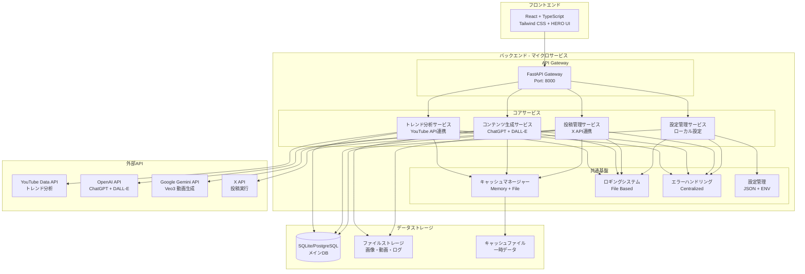
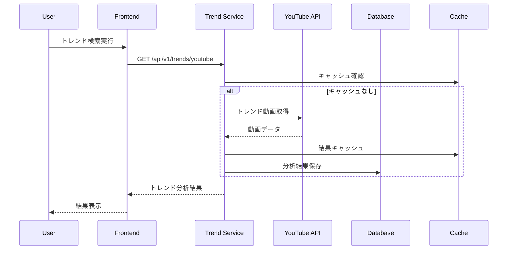
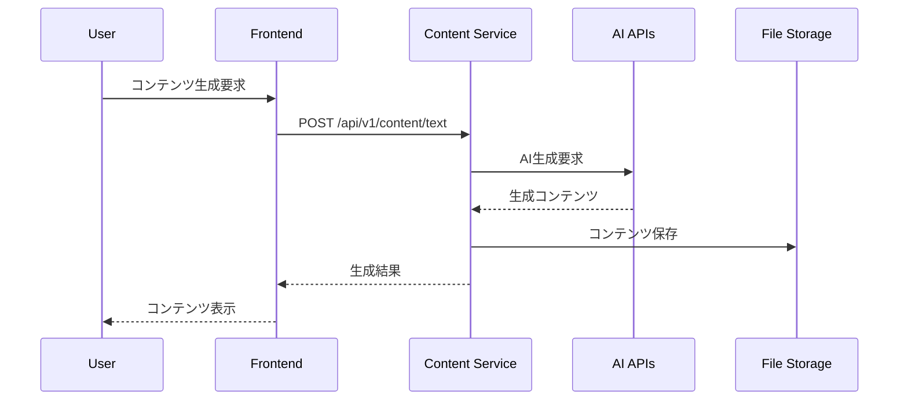
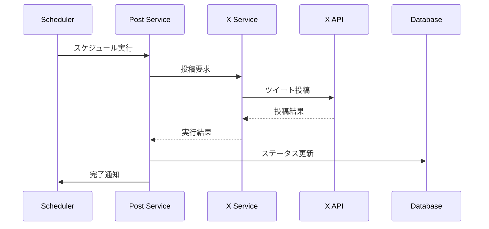

# システムアーキテクチャ設計書

## ドキュメント情報
- **作成日**: 2024年12月19日
- **バージョン**: 1.0
- **対象システム**: Xbot（SNS投稿ボット）システム
- **作成者**: システムアーキテクト

## 1. 概要

### 1.1 目的
本ドキュメントは、Xbot（SNS投稿ボット）システムの全体アーキテクチャを定義し、システム構成、コンポーネント間の関係性、技術スタック、データフロー、およびセキュリティ設計について詳述します。

### 1.2 システム概要
XbotはX（旧Twitter）への自動投稿を生成AIが自動処理するシステムです。YouTubeトレンド分析と外国人視点のリサーチを組み合わせ、その日のバズりトピックを元に、外国人が共感・笑えるようなニッチで親しみやすい投稿を生成・実行します。

### 1.3 システムの特徴
- **個人開発者向け**: シンプルなツールとして設計
- **ローカル環境前提**: 認証機能なし、ローカル環境での利用
- **マイクロサービス**: 疎結合なサービス設計
- **AI活用**: 複数の生成AIサービスを統合活用
- **モダン技術**: 最新の開発技術スタックを採用

## 2. システム全体構成

### 2.1 システム構成図



### 2.2 アーキテクチャパターン
- **マイクロサービスアーキテクチャ**: サービス境界の明確化
- **レイヤードアーキテクチャ**: プレゼンテーション、ビジネス、データレイヤーの分離
- **イベント駆動アーキテクチャ**: 非同期処理とスケジューリング
- **API First**: RESTful API設計

## 3. 技術スタック

### 3.1 フロントエンド
| 技術 | バージョン | 用途 |
|------|-----------|------|
| React | 18.2.0 | UIフレームワーク |
| TypeScript | 4.9+ | 型安全な開発 |
| Vite | 4.2+ | ビルドツール・開発サーバー |
| Tailwind CSS | 3.4+ | CSSフレームワーク |
| HERO UI | 2.7+ | UIコンポーネントライブラリ |
| React Router | 6.22+ | SPA ルーティング |
| Axios | 1.6+ | HTTP クライアント |
| React Hook Form | 7.57+ | フォーム管理 |
| Storybook | 8.0+ | コンポーネント開発 |

### 3.2 バックエンド
| 技術 | バージョン | 用途 |
|------|-----------|------|
| Python | 3.11+ | ランタイム |
| FastAPI | 0.104+ | Webフレームワーク |
| SQLAlchemy | 2.0+ | ORM |
| Alembic | 1.12+ | データベースマイグレーション |
| Pydantic | 2.4+ | データバリデーション |
| asyncio | - | 非同期処理 |
| aiohttp | 3.8+ | 非同期HTTPクライアント |
| Celery | 5.3+ | バックグラウンドタスク処理 |
| pytest | 7.4+ | テストフレームワーク |

### 3.3 データベース
| 技術 | 用途 |
|------|------|
| SQLite | 開発環境・軽量本番環境 |
| PostgreSQL | 本番環境（推奨） |
| JSON Files | 設定・キャッシュ・履歴 |

### 3.4 外部API
| API | 用途 | 制限事項 |
|-----|------|----------|
| YouTube Data API v3 | トレンド動画取得・分析 | 10,000 units/day |
| OpenAI API | テキスト生成（ChatGPT）・画像生成（DALL-E） | 使用量課金 |
| Google Gemini API | 動画生成（Veo3） | 使用量課金 |
| X API v2 | 投稿実行・メトリクス取得 | レート制限あり |

## 4. コンポーネント設計

### 4.1 マイクロサービス構成

#### 4.1.1 トレンド分析サービス
- **責務**: YouTubeトレンド分析、データ収集・分析
- **エンドポイント**: `/api/v1/trends`
- **主要機能**:
  - トレンド動画収集（定期実行）
  - 動画詳細情報取得
  - エンゲージメント分析
  - 地域別・カテゴリ別分析
- **データ管理**: 分析結果のキャッシュ、履歴保存

#### 4.1.2 コンテンツ生成サービス
- **責務**: AI活用コンテンツ生成
- **エンドポイント**: `/api/v1/content`
- **主要機能**:
  - テキスト生成（ChatGPT）
  - 画像生成（DALL-E）
  - 動画生成（Gemini Veo3）
  - プロンプト最適化
  - 生成履歴管理
- **データ管理**: 生成コンテンツ保存、履歴管理

#### 4.1.3 投稿管理サービス
- **責務**: 投稿のライフサイクル管理
- **エンドポイント**: `/api/v1/posts`
- **主要機能**:
  - 投稿作成・編集・削除
  - スケジューリング
  - X API投稿実行
  - エンゲージメント測定
  - 投稿履歴管理
- **データ管理**: 投稿データベース、メトリクス保存

#### 4.1.4 設定管理サービス
- **責務**: システム設定とAPIキー管理
- **エンドポイント**: `/api/v1/settings`
- **主要機能**:
  - APIキー管理
  - システム設定
  - 設定バックアップ・復元
  - 設定検証
- **データ管理**: 設定ファイル、バックアップ管理

### 4.2 共通基盤コンポーネント

#### 4.2.1 キャッシュマネージャー
```python
class CacheManager:
    - memory_cache: Dict[str, Any]  # インメモリキャッシュ
    - file_cache_dir: Path          # ファイルキャッシュディレクトリ
    - default_ttl: int              # デフォルトTTL
    
    + get(key: str) -> Any
    + set(key: str, value: Any, ttl: int)
    + delete(key: str)
    + clear()
    + get_stats() -> CacheStats
```

#### 4.2.2 ロギングシステム
```python
class Logger:
    - log_level: str                # ログレベル
    - log_file: Path               # ログファイルパス
    - rotation_size: int           # ローテーションサイズ
    
    + info(message: str)
    + warning(message: str)
    + error(message: str)
    + debug(message: str)
```

#### 4.2.3 エラーハンドリング
```python
class ErrorHandler:
    + handle_exception(exception: Exception)
    + log_error(error: Error)
    + notify_error(error: Error)
    + retry_operation(func: Callable, max_retries: int)
```

## 5. データ設計

### 5.1 データベース設計

#### 5.1.1 主要テーブル構成

**Postsテーブル**
```sql
CREATE TABLE posts (
    id INTEGER PRIMARY KEY,
    content TEXT NOT NULL,
    scheduled_time DATETIME NOT NULL,
    posted BOOLEAN DEFAULT FALSE,
    created_at DATETIME DEFAULT CURRENT_TIMESTAMP,
    updated_at DATETIME
);
```

**Settingsテーブル**
```sql
CREATE TABLE settings (
    id INTEGER PRIMARY KEY,
    x_api_key TEXT,
    youtube_api_key TEXT,
    openai_api_key TEXT,
    gemini_api_key TEXT,
    search_interval INTEGER DEFAULT 3600,
    max_results INTEGER DEFAULT 10,
    target_regions JSON DEFAULT '[]',
    categories JSON DEFAULT '[]'
);
```

### 5.2 ファイルストレージ構成

```
data/
├── posts/              # 投稿関連データ
│   ├── posts.json     # 投稿データ
│   ├── templates.json # テンプレート
│   └── drafts.json    # 下書き
├── analytics/          # 分析データ
│   └── reports/       # レポートファイル
├── generated_images/   # 生成画像
├── generated_videos/   # 生成動画
└── cache/             # キャッシュファイル
    ├── youtube/       # YouTubeキャッシュ
    └── content/       # コンテンツキャッシュ
```

## 6. API設計

### 6.1 API構成

#### 6.1.1 RESTful API エンドポイント

**トレンド分析API**
```
GET    /api/v1/trends/youtube         # YouTubeトレンド取得
GET    /api/v1/trends/analyze/{id}    # 動画分析
POST   /api/v1/trends/search          # カスタム検索
```

**コンテンツ生成API**
```
POST   /api/v1/content/text           # テキスト生成
POST   /api/v1/content/image          # 画像生成
POST   /api/v1/content/video          # 動画生成
GET    /api/v1/content/history        # 生成履歴
```

**投稿管理API**
```
GET    /api/v1/posts                  # 投稿一覧
POST   /api/v1/posts                  # 投稿作成
PUT    /api/v1/posts/{id}             # 投稿更新
DELETE /api/v1/posts/{id}             # 投稿削除
POST   /api/v1/posts/{id}/publish     # 投稿実行
```

**設定管理API**
```
GET    /api/v1/settings               # 設定取得
PUT    /api/v1/settings               # 設定更新
POST   /api/v1/settings/backup        # バックアップ作成
POST   /api/v1/settings/restore       # 設定復元
```

### 6.2 API レスポンス形式

```json
{
    "status": "success|error",
    "data": {...},
    "message": "メッセージ",
    "timestamp": "2024-12-19T10:00:00Z",
    "request_id": "uuid"
}
```

## 7. データフロー設計

### 7.1 主要データフロー

#### 7.1.1 トレンド分析フロー


#### 7.1.2 コンテンツ生成フロー


#### 7.1.3 投稿実行フロー


### 7.2 非同期処理設計

#### 7.2.1 バックグラウンドタスク
- **トレンド収集**: 60分間隔で定期実行
- **投稿スケジューリング**: 1分間隔でチェック
- **データクリーンアップ**: 24時間間隔で古いデータ削除
- **キャッシュクリーンアップ**: 6時間間隔で期限切れキャッシュ削除

## 8. セキュリティ設計

### 8.1 セキュリティ要件
- **認証・認可**: ローカル環境のため実装なし
- **データ保護**: ローカルファイルシステムベース
- **API キー管理**: 環境変数とローカル設定ファイル
- **通信暗号化**: HTTPS（本番環境推奨）

### 8.2 セキュリティ対策

#### 8.2.1 APIキー管理
```python
# 環境変数での管理
API_KEYS = {
    "YOUTUBE_API_KEY": os.getenv("YOUTUBE_API_KEY"),
    "OPENAI_API_KEY": os.getenv("OPENAI_API_KEY"),
    "GEMINI_API_KEY": os.getenv("GEMINI_API_KEY"),
    "X_API_KEY": os.getenv("X_API_KEY")
}
```

#### 8.2.2 データ保護
- ローカルファイルシステムでの保存
- 設定ファイルの自動バックアップ
- 機密情報の環境変数管理

#### 8.2.3 エラーハンドリング
- 機密情報の非表示
- 適切なログ記録
- エラー通知の実装

## 9. パフォーマンス設計

### 9.1 パフォーマンス要件
- **API応答時間**: 2秒以内
- **バックグラウンド処理**: 5分以内で完了
- **同時接続数**: 10接続（個人利用前提）
- **データベース**: 1万レコード対応

### 9.2 最適化戦略

#### 9.2.1 キャッシュ戦略
- **メモリキャッシュ**: 頻繁にアクセスするデータ
- **ファイルキャッシュ**: API レスポンス結果
- **TTL管理**: データ特性に応じた有効期限設定

#### 9.2.2 データベース最適化
- **インデックス**: 検索条件に応じた適切なインデックス
- **コネクションプール**: 効率的なDB接続管理
- **バッチ処理**: 大量データの効率的処理

## 10. 可用性・拡張性設計

### 10.1 可用性設計
- **エラー回復**: 自動リトライ機能
- **ログ監視**: エラー検出とアラート
- **データバックアップ**: 自動バックアップ機能

### 10.2 拡張性設計
- **マイクロサービス**: サービス単位での独立拡張
- **API バージョニング**: 後方互換性の維持
- **設定管理**: 動的設定変更対応

## 11. 開発・運用設計

### 11.1 開発環境
- **コンテナ化**: Docker対応（オプション）
- **CI/CD**: GitHub Actions活用
- **テスト自動化**: 単体・統合・E2Eテスト

### 11.2 デプロイ戦略
- **ローカル環境**: 開発用セットアップ
- **段階的デプロイ**: サービス単位でのデプロイ
- **ロールバック**: 問題発生時の即座復旧

### 11.3 監視・ログ
- **アプリケーションログ**: 機能別ログ出力
- **エラーログ**: 集約的エラー管理
- **パフォーマンス監視**: レスポンス時間測定

## 12. 制約事項・前提条件

### 12.1 技術的制約
- **個人利用限定**: マルチユーザー対応なし
- **ローカル環境**: 認証機能なし
- **外部API依存**: 各APIの制限事項に準拠

### 12.2 運用制約
- **手動運用**: 基本的に手動での操作
- **データ管理**: ローカルファイルベース
- **スケーラビリティ**: 小規模利用前提

## 13. 今後の拡張計画

### 13.1 短期拡張計画（1-3ヶ月）
- 高度な分析機能追加
- UI/UX改善
- パフォーマンス最適化

### 13.2 中期拡張計画（3-6ヶ月）
- 新しいAIサービス連携
- 詳細な分析レポート機能
- バックアップ・復元機能強化

### 13.3 長期拡張計画（6ヶ月以上）
- クラウド対応
- 多言語対応
- 高度な自動化機能

## 14. 関連ドキュメント

- [プロジェクト概要](../README.md)
- [機能仕様書](features.md)
- [開発工程ドキュメント](development_process.md)
- [セットアップ手順](setup.md)
- [単体テスト仕様書](../backend/docs/unit_test_specification.md)

---

**承認者**
- システムアーキテクト: [署名欄]
- 開発リーダー: [署名欄]
- 品質保証: [署名欄]

**改版履歴**
| バージョン | 日付 | 変更内容 | 担当者 |
|-----------|------|----------|--------|
| 1.0 | 2024-12-19 | 初版作成 | システムアーキテクト | 